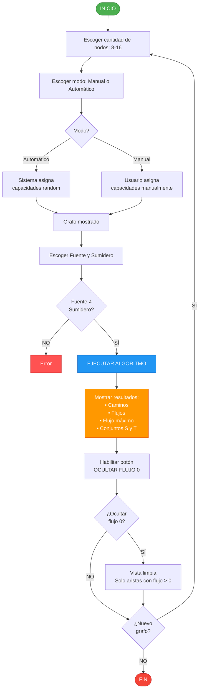

# Algoritmo de Flujo Máximo (Ford-Fulkerson)

## Diagrama de Flujo del Programa

```mermaid
flowchart TD
    A([INICIO]) --> B[Escoger cantidad de nodos: 8-16]
    B --> C[Escoger modo: Manual o Automático] 
    C --> E{Modo?}
    
    E -->|Automático| F[Sistema asigna<br/>capacidades random]
    E -->|Manual| G[Usuario asigna<br/>capacidades manualmente]
    
    F --> H[Grafo mostrado]
    G --> H
    
    H --> I[Escoger Fuente y Sumidero]
    
    I --> K{Fuente ≠<br/>Sumidero?}
    
    K -->|NO| L[Error]
    
    K -->|SÍ| N[EJECUTAR ALGORITMO]
    
    
    N --> O[Mostrar resultados:<br/>• Caminos<br/>• Flujos<br/>• Flujo máximo<br/>• Conjuntos S y T]
    
    O --> P[Habilitar botón<br/>OCULTAR FLUJO 0]
    
    P --> Q{¿Ocultar<br/>flujo 0?}
    
    Q -->|SÍ| R[Vista limpia<br/>Solo aristas con flujo > 0]
    Q -->|NO| S{¿Nuevo<br/>grafo?}
    
    R --> S
    
    S -->|SÍ| B
    S -->|NO| T([FIN])
    
    style A fill:#4CAF50,stroke:#2E7D32,color:#fff
    style T fill:#f44336,stroke:#c62828,color:#fff
    style N fill:#2196F3,stroke:#1565C0,color:#fff
    style O fill:#FF9800,stroke:#E65100,color:#fff
    style L fill:#ff5252,stroke:#d32f2f,color:#fff
```
